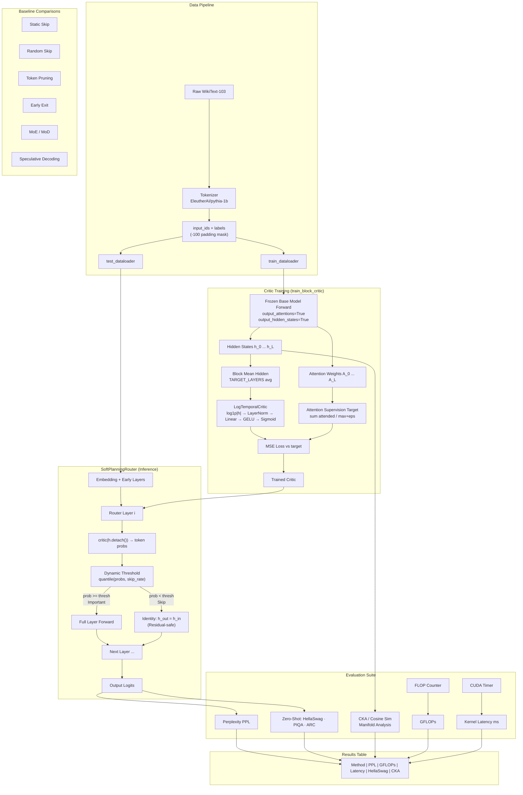
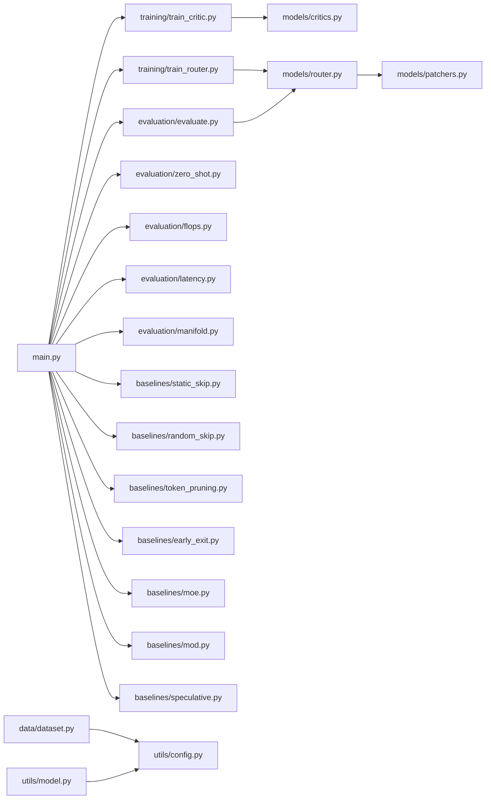

# SoftLayer — System Architecture

## Overview

SoftLayer is an adaptive layer-skipping framework for transformer LLMs. An attention-supervised `LogTemporalCritic` learns to predict token saliency, and a `SoftPlanningRouter` uses this per-token signal to skip unimportant layers at inference time — with a residual-safe identity mapping ensuring mathematical correctness.

---

## Full System Diagram



> Raw `.mmd` file: [`docs/diagrams/system.mmd`](diagrams/system.mmd)

---

## Module Map



---

## Critic Architecture

```
Input: hidden_state h  [batch, seq, dim]
    ↓
log1p(|h|)             [batch, seq, dim]  — log-scale stabilization
    ↓
LayerNorm(dim)
    ↓
Linear(dim → hidden)
    ↓
GELU
    ↓
Linear(hidden → 1)
    ↓
Sigmoid                → saliency score ∈ [0, 1]
```

## Router Skip Decision

```
probs = critic(h.detach())                  # [batch, seq, 1]
thresh = quantile(probs.view(-1), skip_rate)
mask = (probs >= thresh).to(h.dtype)        # 1 = process, 0 = skip

h_out = (layer(h) * mask) + (h * (1 - mask))  # Goldilocks zone
```
