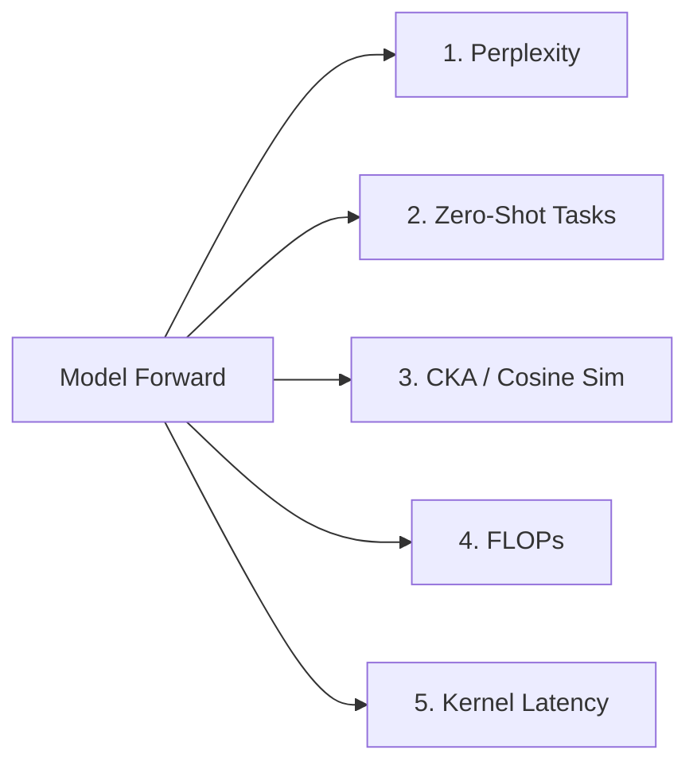

# Evaluation Metrics

All metrics are computed under the same model/data conditions. PPL alone is insufficient — architectural modifications must be validated across representation quality, downstream task performance, efficiency, and latency.

---

## Metrics Pipeline



---

## 1. Perplexity (PPL)

$$\text{PPL} = \exp\left(\frac{-\sum_{t} \log p(x_t | x_{<t})}{N}\right)$$

- Computed on WikiText-103 test set.
- Labels must be **-100 masked** at padding positions (otherwise PPL is inflated).
- Report as `PPL ↓` (lower is better).

```python
# Pseudocode
def compute_ppl(model, dataloader):
    total_nll, total_tokens = 0, 0
    for batch in dataloader:
        ids, labels = batch["input_ids"].cuda(), batch["labels"].cuda()
        out = model(ids, labels=labels)
        active = (labels != -100).sum()
        total_nll += out.loss * active
        total_tokens += active
    return torch.exp(total_nll / total_tokens).item()
```

---

## 2. Zero-Shot Downstream Evaluations

PPL is no longer accepted as the sole metric for architectural modifications. We evaluate on:

| Task | Metric | Notes |
|---|---|---|
| HellaSwag | Acc ↑ | Sentence completion, commonsense |
| PIQA | Acc ↑ | Physical intuition QA |
| ARC-Easy | Acc ↑ | Elementary science QA |
| ARC-Challenge | Acc ↑ | Harder science QA |
| WinoGrande | Acc ↑ | Coreference resolution |

**Tool:** [lm-evaluation-harness](https://github.com/EleutherAI/lm-evaluation-harness)

```bash
# Run zero-shot eval (pseudocode CLI)
lm_eval --model hf \
        --model_args pretrained=EleutherAI/pythia-1b \
        --tasks hellaswag,piqa,arc_easy,arc_challenge,winogrande \
        --device cuda \
        --batch_size 8
```

```python
# Pseudocode for wrapping a patched model
def run_zero_shot(patched_model, tasks=["hellaswag", "piqa", "arc_easy"]):
    lm = HFLMWrapper(patched_model, tokenizer)
    results = evaluator.simple_evaluate(model=lm, tasks=tasks)
    return results
```

**Implementation:** `evaluation/zero_shot.py`

---

## 3. Manifold Analysis — CKA & Cosine Similarity

**Critical:** Without representation analysis, we cannot distinguish a model that skips layers correctly from one that collapses internal representations.

### Centered Kernel Alignment (CKA)

$$\text{CKA}(X, Y) = \frac{\text{HSIC}(K, L)}{\sqrt{\text{HSIC}(K, K) \cdot \text{HSIC}(L, L)}}$$

where $K = XX^T$, $L = YY^T$ and HSIC is the Hilbert-Schmidt Independence Criterion.

- CKA = 1.0: identical representations
- CKA ≈ 0.0: completely uncorrelated representations

```python
# Pseudocode
def cka(X, Y):
    # X, Y: [n_samples, dim]
    K = X @ X.T
    L = Y @ Y.T
    K_centered = center_kernel(K)
    L_centered = center_kernel(L)
    hsic_kl = (K_centered * L_centered).sum()
    hsic_kk = (K_centered * K_centered).sum()
    hsic_ll = (L_centered * L_centered).sum()
    return hsic_kl / (hsic_kk * hsic_ll).sqrt()

def layer_cka_table(base_model, patched_model, dataloader):
    # Returns [num_layers] CKA scores comparing base vs patched hidden states
    base_hs = extract_hidden_states(base_model, dataloader)
    patch_hs = extract_hidden_states(patched_model, dataloader)
    return [cka(base_hs[i], patch_hs[i]) for i in range(num_layers)]
```

### Cosine Similarity per Layer

$$\text{CosSim}(h_{\text{base}}, h_{\text{skip}}) = \frac{h_{\text{base}} \cdot h_{\text{skip}}}{\|h_{\text{base}}\| \|h_{\text{skip}}\|}$$

**Implementation:** `evaluation/manifold.py`

---

## 4. FLOPs

FLOPs measure the theoretical compute cost of a forward pass.

$$\text{FLOPs}_{\text{attn}} = 4 \cdot B \cdot S^2 \cdot D + 4 \cdot B \cdot S \cdot D^2$$
$$\text{FLOPs}_{\text{ffn}} = 2 \cdot B \cdot S \cdot D \cdot D_{\text{ff}}$$

- Skipped layers contribute $0$ FLOPs.
- Report as `GFLOPs ↓` (lower is better at matched PPL).

```python
# Pseudocode using fvcore
from fvcore.nn import FlopCountAnalysis

def measure_flops(model, input_ids):
    flops = FlopCountAnalysis(model, input_ids)
    return flops.total() / 1e9  # GFLOPs
```

**Implementation:** `evaluation/flops.py`

---

## 5. Kernel-Level Latency

Latency is wall-clock time measured at the CUDA kernel level using `torch.cuda.Event` for GPU-accurate timing.

```python
# Pseudocode
def measure_latency(model, input_ids, warmup=5, runs=50):
    # Warmup
    for _ in range(warmup):
        with torch.no_grad():
            _ = model(input_ids)
    torch.cuda.synchronize()

    start = torch.cuda.Event(enable_timing=True)
    end = torch.cuda.Event(enable_timing=True)

    start.record()
    for _ in range(runs):
        with torch.no_grad():
            _ = model(input_ids)
    end.record()
    torch.cuda.synchronize()

    avg_ms = start.elapsed_time(end) / runs
    return avg_ms  # milliseconds per forward pass
```

- Report per-layer latency breakdown for ablation.
- Report end-to-end latency for comparison.

**Implementation:** `evaluation/latency.py`

---

## Reporting Format

All results reported as mean ± std over 3 seeds where applicable.

| Method | PPL ↓ | GFLOPs ↓ | Latency (ms) ↓ | HellaSwag ↑ | PIQA ↑ | ARC-e ↑ | CKA (avg) |
|---|---|---|---|---|---|---|---|
| Full Model | | | | | | | 1.000 |
| Static 25% | | | | | | | |
| Static 50% | | | | | | | |
| Random Skip | | | | | | | |
| Token Pruning | | | | | | | |
| Early Exit | | | | | | | |
| MoE | | | | | | | |
| MoD | | | | | | | |
| Speculative | | | | | | | |
| **SoftLayer (ours)** | | | | | | | |
